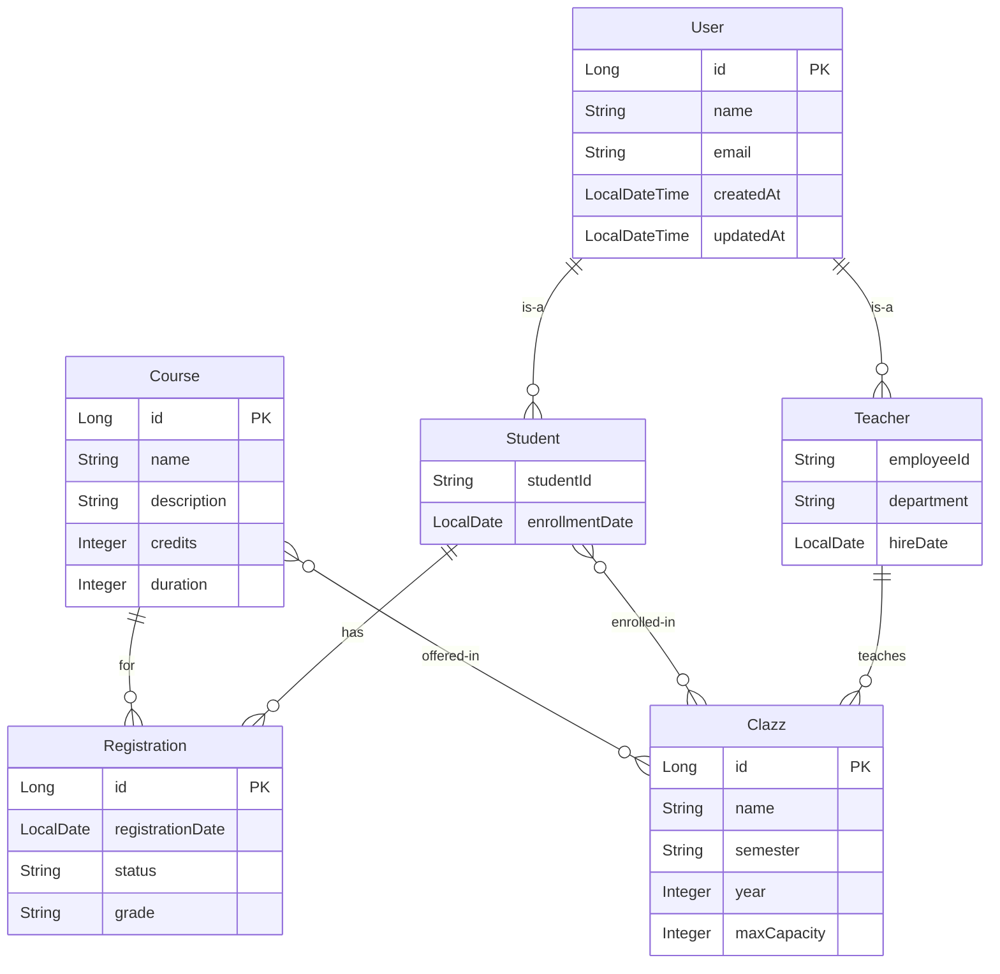

# Design Document

## Overview

The Online School Backend is a Spring Boot application that provides RESTful APIs for managing an educational system. The application follows a layered architecture pattern with clear separation of concerns between presentation, business logic, and data access layers. The system uses JPA for ORM, H2 in-memory database for persistence, and follows Spring Boot conventions for configuration and dependency injection.

## Architecture

### Layered Architecture
```
┌─────────────────────────────────────┐
│           Controller Layer          │  ← REST endpoints, request/response handling
├─────────────────────────────────────┤
│            Service Layer            │  ← Business logic, transaction management
├─────────────────────────────────────┤
│          Repository Layer           │  ← Data access, JPA repositories
├─────────────────────────────────────┤
│            Entity Layer             │  ← JPA entities, domain models
├─────────────────────────────────────┤
│          H2 Database Layer          │  ← In-memory database storage
└─────────────────────────────────────┘
```

### Package Structure
```
com.bootcamp.onlineschool
├── OnlineSchoolApplication.java
├── controller/
│   ├── UserController.java
│   ├── StudentController.java
│   ├── TeacherController.java
│   ├── CourseController.java
│   ├── ClazzController.java
│   └── RegistrationController.java
├── service/
│   ├── UserService.java
│   ├── StudentService.java
│   ├── TeacherService.java
│   ├── CourseService.java
│   ├── ClazzService.java
│   └── RegistrationService.java
├── repository/
│   ├── UserRepository.java
│   ├── StudentRepository.java
│   ├── TeacherRepository.java
│   ├── CourseRepository.java
│   ├── ClazzRepository.java
│   └── RegistrationRepository.java
├── entity/
│   ├── User.java
│   ├── Student.java
│   ├── Teacher.java
│   ├── Course.java
│   ├── Clazz.java
│   └── Registration.java
├── dto/
│   ├── UserDTO.java
│   ├── StudentDTO.java
│   ├── TeacherDTO.java
│   ├── CourseDTO.java
│   ├── ClazzDTO.java
│   └── RegistrationDTO.java
└── exception/
    ├── GlobalExceptionHandler.java
    ├── ResourceNotFoundException.java
    └── ValidationException.java
```

## Components and Interfaces

### Entity Design

#### User Entity (Base Class)
- **Inheritance Strategy**: TABLE_PER_CLASS or JOINED table strategy
- **Attributes**: id, name, email, createdAt, updatedAt
- **Annotations**: @Entity, @Inheritance, @Id, @GeneratedValue, @Column, @CreationTimestamp, @UpdateTimestamp

#### Student Entity
- **Extends**: User
- **Additional Attributes**: studentId, enrollmentDate
- **Relationships**: 
  - Many-to-Many with Clazz (through enrollment)
  - One-to-Many with Registration

#### Teacher Entity
- **Extends**: User
- **Additional Attributes**: employeeId, department, hireDate
- **Relationships**: 
  - One-to-Many with Clazz (as instructor)

#### Course Entity
- **Attributes**: id, name, description, credits, duration
- **Relationships**: 
  - Many-to-Many with Clazz
  - One-to-Many with Registration

#### Clazz Entity
- **Attributes**: id, name, semester, year, maxCapacity
- **Relationships**: 
  - Many-to-One with Teacher
  - Many-to-Many with Student
  - Many-to-Many with Course

#### Registration Entity
- **Attributes**: id, registrationDate, status, grade
- **Relationships**: 
  - Many-to-One with Student
  - Many-to-One with Course

### Repository Layer
- **Base Interface**: JpaRepository<Entity, Long>
- **Custom Query Methods**: Derived queries and @Query annotations
- **Advanced Queries**: Custom repository implementations for complex operations

### Service Layer
- **Transaction Management**: @Transactional annotations
- **Business Logic**: Validation, entity relationship management
- **DTO Conversion**: Entity to DTO mapping

### Controller Layer
- **REST Endpoints**: @RestController with @RequestMapping
- **HTTP Methods**: GET, POST, PUT, DELETE for each entity
- **Request/Response**: JSON format with proper HTTP status codes
- **Validation**: @Valid annotations with Bean Validation

## Data Models

### Entity Relationship Diagram


### Database Configuration
- **Database**: H2 in-memory database
- **JPA Provider**: Hibernate
- **Connection URL**: jdbc:h2:mem:testdb
- **H2 Console**: Enabled for development
- **DDL Strategy**: create-drop for development

## Error Handling

### Exception Hierarchy
- **ResourceNotFoundException**: For entity not found scenarios
- **ValidationException**: For business rule violations
- **DataIntegrityViolationException**: For database constraint violations

### Global Exception Handler
- **@ControllerAdvice**: Centralized exception handling
- **HTTP Status Mapping**: 
  - 404 for ResourceNotFoundException
  - 400 for ValidationException
  - 500 for internal server errors
- **Error Response Format**: Consistent JSON error structure

### Validation Strategy
- **Bean Validation**: @NotNull, @NotBlank, @Email, @Size annotations
- **Custom Validators**: For business-specific validation rules
- **Service Layer Validation**: Additional business logic validation

## Testing Strategy

### Unit Testing
- **Service Layer**: Mock repository dependencies
- **Repository Layer**: @DataJpaTest for repository testing
- **Controller Layer**: @WebMvcTest for web layer testing

### Integration Testing
- **@SpringBootTest**: Full application context testing
- **TestContainers**: For database integration tests (if needed)
- **MockMvc**: For API endpoint testing

### Test Data Management
- **@Sql**: For test data setup
- **@Transactional**: For test isolation
- **Test Profiles**: Separate configuration for testing

### API Documentation
- **Swagger/OpenAPI**: Automatic API documentation generation
- **@ApiOperation**: Method-level documentation
- **@ApiModel**: DTO documentation
- **Swagger UI**: Interactive API documentation interface